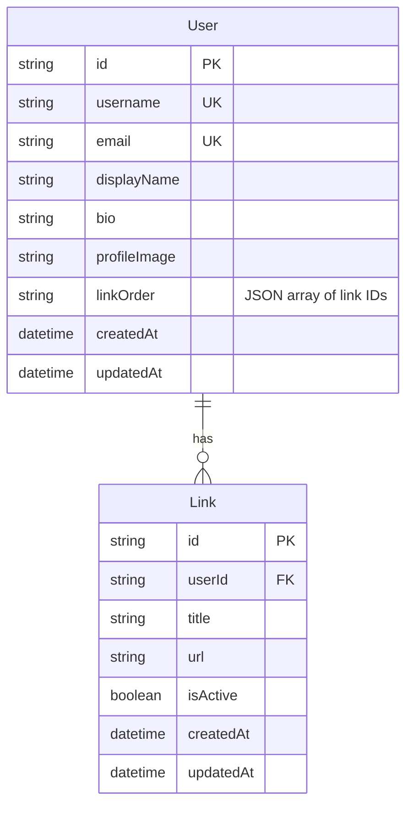

# feat: Link-in-Bio Tool (Lincoln Bio)

A simple, themeable link-in-bio tool with an editor and public bio page. Mobile-first, creator-friendly, setup in under 5 minutes.

## Simplification Summary

**Simplified on:** 2026-01-19
**Reviewers:** DHH philosophy, Kieran quality standards, Code simplicity

### Changes from Previous Plan
1. **Removed SaveCoordinator** - Simple debounced save hook instead
2. **Removed EditorContext/Reducer** - Local `useState` in dashboard
3. **Removed TextBlocks** - Links only for MVP, defer to v1.1
4. **Single theme** - Ship with Minimal, add more based on feedback
5. **Inline URL validation** - Zod only, no separate validator file
6. **Removed navigation guard** - Trust autosave
7. **Removed dynamic OG images** - Static meta tags
8. **Trust platform rate limiting** - No Upstash dependency
9. **Simplified project structure** - ~15 files instead of ~30

---

## Overview

Build a Linktree-style link-in-bio tool with:
- **Editor**: Simple list management with live preview
- **Public Page**: Fast, mobile-optimized bio page at `/{username}`
- **Theming**: One clean theme (add more later based on feedback)

**Not building (MVP)**: Text blocks, multiple themes, analytics, commerce.

---

## Tech Stack

| Layer | Technology | Reason |
|-------|------------|--------|
| Framework | Next.js 15 (App Router) | SSR/SSG, API routes, image optimization |
| Styling | Tailwind CSS v4 | Mobile-first, simple theming |
| Components | shadcn/ui | Accessible, minimal |
| Database | SQLite + Prisma (dev) / Turso (prod) | Simple, edge-ready |
| Auth | NextAuth.js + Magic Links | Fast onboarding |
| Image Storage | Vercel Blob | Zero-config with Next.js |
| Deployment | Vercel | Native Next.js support |

---

## Data Model



### Schema (Prisma)

```prisma
// prisma/schema.prisma
datasource db {
  provider = "sqlite"
  url      = env("DATABASE_URL")
}

generator client {
  provider        = "prisma-client-js"
  previewFeatures = ["driverAdapters"]
}

model User {
  id            String   @id @default(cuid())
  username      String   @unique
  email         String   @unique
  displayName   String?
  bio           String?
  profileImage  String?
  linkOrder     String   @default("[]") // JSON array of link IDs
  createdAt     DateTime @default(now())
  updatedAt     DateTime @updatedAt

  links         Link[]
}

model Link {
  id        String   @id @default(cuid())
  userId    String
  title     String
  url       String
  isActive  Boolean  @default(true)
  createdAt DateTime @default(now())
  updatedAt DateTime @updatedAt

  user      User     @relation(fields: [userId], references: [id], onDelete: Cascade)

  @@index([userId])
}
```

**Note:** No `@@index([username])` - the `@unique` constraint already creates an index.

---

## Project Structure

```
lincoln-bio/
├── app/
│   ├── (auth)/
│   │   └── login/page.tsx          # Magic link login
│   ├── dashboard/
│   │   └── page.tsx                # Editor (all state here)
│   ├── [username]/
│   │   └── page.tsx                # Public bio page (SSG + ISR)
│   ├── api/
│   │   ├── auth/[...nextauth]/route.ts
│   │   ├── profile/route.ts        # User profile CRUD
│   │   ├── links/route.ts          # Links CRUD
│   │   └── upload/route.ts         # Image upload
│   ├── layout.tsx
│   ├── page.tsx                    # Landing/marketing
│   └── globals.css
├── components/
│   ├── ui/                         # shadcn (button, input, card, avatar)
│   ├── link-editor.tsx             # Single link edit form
│   ├── link-list.tsx               # Sortable link list
│   ├── profile-form.tsx            # Profile editing
│   ├── bio-page.tsx                # Public page renderer (shared)
│   └── bio-link.tsx                # Link button component
├── lib/
│   ├── db.ts                       # Prisma client
│   ├── auth.ts                     # NextAuth config
│   ├── schemas.ts                  # Zod schemas (with URL validation)
│   └── use-debounced-save.ts       # Simple save hook (~15 lines)
├── prisma/
│   └── schema.prisma
└── package.json
```

**~15 files total** instead of 30+.

---

## Implementation Phases

### Phase 1: Foundation

**Goal**: Project setup with auth and database.

#### Tasks

- [x] Initialize Next.js 15 project
  ```bash
  npx create-next-app@latest lincoln-bio --typescript --tailwind --eslint --app
  ```
- [x] Install shadcn/ui
  ```bash
  npx shadcn@latest init
  npx shadcn@latest add button input label card avatar
  ```
- [x] Set up Prisma with SQLite
  ```bash
  npm install prisma @prisma/client
  npx prisma init --datasource-provider sqlite
  ```
- [x] Create database schema (User, Link)
- [x] Set up NextAuth.js with magic link
  ```bash
  npm install next-auth @auth/prisma-adapter resend
  ```
- [x] Create login page
- [x] Add auth middleware

**Files to create:**
- `prisma/schema.prisma`
- `lib/db.ts`
- `lib/auth.ts`
- `app/api/auth/[...nextauth]/route.ts`
- `app/(auth)/login/page.tsx`
- `middleware.ts`

#### Auth Setup

```typescript
// lib/auth.ts
import NextAuth from "next-auth"
import Resend from "next-auth/providers/resend"
import { PrismaAdapter } from "@auth/prisma-adapter"
import { prisma } from "@/lib/db"

export const { handlers, auth, signIn, signOut } = NextAuth({
  adapter: PrismaAdapter(prisma),
  providers: [
    Resend({
      apiKey: process.env.AUTH_RESEND_KEY,
      from: "Lincoln Bio <auth@lincolnbio.app>",
    }),
  ],
  pages: {
    signIn: "/login",
  },
  callbacks: {
    session({ session, user }) {
      session.user.id = user.id
      session.user.username = user.username
      return session
    },
  },
})
```

```typescript
// middleware.ts
import { auth } from "@/lib/auth"
import { NextResponse } from "next/server"

export default auth((req) => {
  const isLoggedIn = !!req.auth?.user
  const isProtected = req.nextUrl.pathname.startsWith('/dashboard')

  if (isProtected && !isLoggedIn) {
    return NextResponse.redirect(new URL('/login', req.nextUrl.origin))
  }
})

export const config = { matcher: ['/dashboard/:path*'] }
```

---

### Phase 2: Editor

**Goal**: Functional editor with profile and links.

#### Tasks

- [x] Build dashboard page with local state
- [x] Create profile form (photo, name, bio, username)
- [x] Implement image upload to Vercel Blob
  ```bash
  npm install @vercel/blob
  ```
- [x] Create link editor component
- [x] Implement link reordering (HTML5 drag or up/down buttons)
- [x] Add debounced autosave hook
- [x] Build live preview (shared bio components)
- [x] Add revalidation after saves

**Files to create:**
- `app/dashboard/page.tsx`
- `components/profile-form.tsx`
- `components/link-editor.tsx`
- `components/link-list.tsx`
- `components/bio-page.tsx`
- `components/bio-link.tsx`
- `lib/use-debounced-save.ts`
- `lib/schemas.ts`
- `app/api/profile/route.ts`
- `app/api/links/route.ts`
- `app/api/upload/route.ts`

#### Simple Debounced Save

```typescript
// lib/use-debounced-save.ts
import { useRef, useCallback, useState } from 'react'

export function useDebouncedSave(
  saveFn: () => Promise<void>,
  delay = 800
) {
  const timeoutRef = useRef<NodeJS.Timeout>()
  const [saving, setSaving] = useState(false)

  const save = useCallback(() => {
    clearTimeout(timeoutRef.current)
    timeoutRef.current = setTimeout(async () => {
      setSaving(true)
      await saveFn()
      setSaving(false)
    }, delay)
  }, [saveFn, delay])

  return { save, saving }
}
```

#### Dashboard with Local State

```typescript
// app/dashboard/page.tsx
'use client'

import { useState } from 'react'
import { ProfileForm } from '@/components/profile-form'
import { LinkList } from '@/components/link-list'
import { BioPage } from '@/components/bio-page'
import { useDebouncedSave } from '@/lib/use-debounced-save'

export default function Dashboard({ initialData }) {
  const [profile, setProfile] = useState(initialData.profile)
  const [links, setLinks] = useState(initialData.links)

  const { save: saveProfile, saving: savingProfile } = useDebouncedSave(
    async () => {
      await fetch('/api/profile', {
        method: 'PATCH',
        body: JSON.stringify(profile),
      })
    }
  )

  const { save: saveLinks, saving: savingLinks } = useDebouncedSave(
    async () => {
      await fetch('/api/links', {
        method: 'PUT',
        body: JSON.stringify({ links, order: links.map(l => l.id) }),
      })
    }
  )

  return (
    <div className="grid grid-cols-2 gap-8">
      <div className="space-y-6">
        <ProfileForm
          profile={profile}
          onChange={(p) => { setProfile(p); saveProfile() }}
          saving={savingProfile}
        />
        <LinkList
          links={links}
          onChange={(l) => { setLinks(l); saveLinks() }}
          saving={savingLinks}
        />
      </div>
      <div className="sticky top-4">
        <BioPage profile={profile} links={links} isPreview />
      </div>
    </div>
  )
}
```

#### Zod Schemas with URL Validation

```typescript
// lib/schemas.ts
import { z } from 'zod'

export const urlSchema = z.string().url().max(2048).refine(
  (url) => {
    try {
      const parsed = new URL(url)
      return ['http:', 'https:'].includes(parsed.protocol)
    } catch {
      return false
    }
  },
  'Only HTTP/HTTPS URLs allowed'
)

export const createLinkSchema = z.object({
  title: z.string().min(1).max(100).trim(),
  url: urlSchema,
})

export const updateProfileSchema = z.object({
  displayName: z.string().max(50).trim().optional(),
  bio: z.string().max(500).trim().optional(),
  username: z.string()
    .min(3).max(30)
    .regex(/^[a-z0-9_]+$/, 'Lowercase letters, numbers, underscores only')
    .optional(),
})
```

#### Link Reordering (Simple Approach)

Instead of @dnd-kit, use up/down buttons:

```typescript
// components/link-list.tsx
function moveLink(links: Link[], index: number, direction: 'up' | 'down') {
  const newIndex = direction === 'up' ? index - 1 : index + 1
  if (newIndex < 0 || newIndex >= links.length) return links

  const newLinks = [...links]
  ;[newLinks[index], newLinks[newIndex]] = [newLinks[newIndex], newLinks[index]]
  return newLinks
}

export function LinkList({ links, onChange }) {
  return (
    <div className="space-y-2">
      {links.map((link, i) => (
        <div key={link.id} className="flex items-center gap-2">
          <div className="flex flex-col">
            <button
              onClick={() => onChange(moveLink(links, i, 'up'))}
              disabled={i === 0}
            >
              ↑
            </button>
            <button
              onClick={() => onChange(moveLink(links, i, 'down'))}
              disabled={i === links.length - 1}
            >
              ↓
            </button>
          </div>
          <LinkEditor link={link} onChange={/* ... */} />
        </div>
      ))}
    </div>
  )
}
```

#### Link Order Cleanup

When deleting a link, clean up the order array:

```typescript
// app/api/links/route.ts
export async function DELETE(request: Request) {
  const session = await auth()
  const { id } = await request.json()

  // Delete link
  await db.link.delete({ where: { id, userId: session.user.id } })

  // Clean up linkOrder
  const user = await db.user.findUnique({
    where: { id: session.user.id },
    select: { linkOrder: true, username: true }
  })

  const order = JSON.parse(user.linkOrder || '[]')
  const cleanedOrder = order.filter((linkId: string) => linkId !== id)

  await db.user.update({
    where: { id: session.user.id },
    data: { linkOrder: JSON.stringify(cleanedOrder) }
  })

  // Revalidate public page
  revalidatePath(`/${user.username}`)

  return Response.json({ success: true })
}
```

---

### Phase 3: Public Bio Page

**Goal**: Fast, SEO-optimized public page.

#### Tasks

- [x] Create `[username]` route with SSG + on-demand ISR
- [x] Build bio page renderer (shared with editor)
- [x] Add Open Graph meta tags (static)
- [x] Handle 404 for invalid usernames
- [x] Optimize for Core Web Vitals

**Files to create/update:**
- `app/[username]/page.tsx`

#### SSG with On-Demand Revalidation

```typescript
// app/[username]/page.tsx
import { notFound } from 'next/navigation'
import { BioPage } from '@/components/bio-page'
import { db } from '@/lib/db'

export const revalidate = false // Use on-demand only
export const dynamicParams = true

export async function generateStaticParams() {
  const users = await db.user.findMany({
    select: { username: true },
    take: 1000,
  })
  return users.map(user => ({ username: user.username }))
}

export async function generateMetadata({ params }) {
  const { username } = await params
  const user = await getUser(username)

  if (!user) return { title: 'Not Found' }

  return {
    title: `${user.displayName || user.username} | Lincoln Bio`,
    description: user.bio || `Check out ${user.username}'s links`,
    openGraph: {
      title: user.displayName || user.username,
      description: user.bio,
      images: user.profileImage ? [user.profileImage] : [],
    },
  }
}

export default async function UserPage({ params }) {
  const { username } = await params
  const user = await getUser(username)

  if (!user) notFound()

  return <BioPage profile={user} links={user.links} />
}

async function getUser(username: string) {
  const user = await db.user.findUnique({
    where: { username },
    include: { links: { where: { isActive: true } } },
  })

  if (!user) return null

  // Sort links by order
  const order = JSON.parse(user.linkOrder || '[]')
  const sortedLinks = order
    .map((id: string) => user.links.find(l => l.id === id))
    .filter(Boolean)

  return { ...user, links: sortedLinks }
}
```

---

### Phase 4: Polish & Deploy

**Goal**: Production-ready with basic error handling.

#### Tasks

- [x] Add loading states
- [x] Add inline save indicator ("Saved" text, not toast)
- [x] Validate username (reserved words, format)
- [ ] Configure Vercel deployment
- [x] Add essential security headers
- [ ] Set up Turso for production

**Files to update:**
- `next.config.ts` (security headers)
- `lib/db.ts` (Turso adapter)

#### Essential Security Headers

```typescript
// next.config.ts
export default {
  async headers() {
    return [{
      source: '/:path*',
      headers: [
        { key: 'X-Frame-Options', value: 'DENY' },
        { key: 'X-Content-Type-Options', value: 'nosniff' },
        { key: 'Strict-Transport-Security', value: 'max-age=63072000; includeSubDomains' },
      ],
    }]
  },
}
```

---

## Acceptance Criteria

### Setup Flow
- [ ] User can sign up with email (magic link) in under 2 minutes
- [ ] User can claim unique username
- [ ] User can upload profile photo
- [ ] User can add display name and bio

### Editor
- [ ] User can add/edit/delete links
- [ ] User can reorder links
- [ ] User can toggle link visibility
- [ ] Changes autosave with "Saved" indicator
- [ ] Live preview updates in real-time

### Public Page
- [ ] Page loads at `/{username}`
- [ ] Page displays links in correct order
- [ ] Links open in new tab
- [ ] Page is mobile-responsive
- [ ] Page has Open Graph meta tags
- [ ] Invalid username shows 404
- [ ] Changes reflect after save (on-demand revalidation)

### Performance
- [ ] Public page LCP < 1.5s
- [ ] Public page bundle < 50KB
- [ ] Save operations < 500ms

---

## Key Decisions

| Decision | Choice | Rationale |
|----------|--------|-----------|
| Auth method | Magic links | Fastest onboarding |
| Image storage | Vercel Blob | Zero-config |
| State management | Local useState | Simple, sufficient |
| Link reordering | Up/down buttons | No dependencies |
| Themes | 1 (Minimal) | Ship fast, add based on feedback |
| TextBlocks | Deferred to v1.1 | Links-only MVP |
| Save mechanism | Simple debounce | No queue needed for single user |
| Rate limiting | Vercel platform | No extra dependencies |

---

## Deferred to v1.1

- Text blocks (headings, dividers)
- Additional themes (Brutalist, Editorial)
- Theme customization (colors, button styles)
- Custom domains
- Analytics

---

## References

- [Next.js App Router](https://nextjs.org/docs/app)
- [Prisma with SQLite](https://www.prisma.io/docs/concepts/database-connectors/sqlite)
- [Auth.js / NextAuth.js](https://authjs.dev/)
- [Vercel Blob](https://vercel.com/docs/storage/vercel-blob)
- [Turso + Prisma](https://docs.turso.tech/sdk/ts/orm/prisma)
